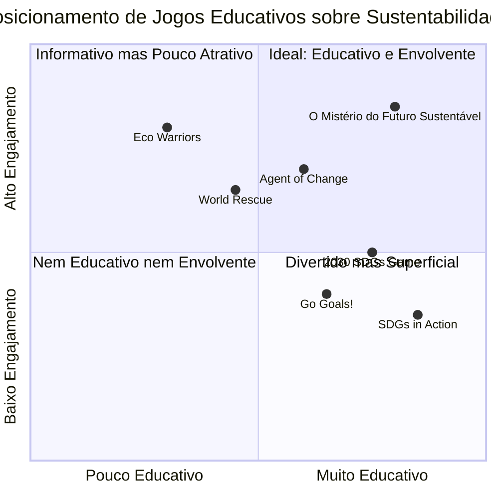

# PRD: O Mistério do Futuro Sustentável

## Informações do Projeto

**Idioma:** Português (Brasil)
**Linguagem de Programação:** React, JavaScript e Tailwind CSS
**Nome do Projeto:** o_misterio_do_futuro_sustentavel

**Requisitos Originais:**
Desenvolver um jogo educativo investigativo sobre os Objetivos de Desenvolvimento Sustentável (ODS), onde jogadores adolescentes e jovens adultos investigam e resolvem mistérios relacionados à sustentabilidade. O jogo deve ter como cenário o ano 2030, com os jogadores assumindo o papel de "Agentes da Sustentabilidade" que resolvem múltiplos casos relacionados aos ODS. O jogo deve incluir mecânicas como coleta de pistas, análise de dados, diálogos, resolução de quebra-cabeças, uma estrutura narrativa baseada nos 17 ODS, personagens representando diferentes atores envolvidos com sustentabilidade, e integração eficaz do conteúdo educacional.

## Definição do Produto

### Metas do Produto

1. **Educação Engajadora:** Criar uma experiência imersiva que ensine os jogadores sobre os 17 ODS e a importância da sustentabilidade de forma envolvente e memorável.

2. **Desenvolvimento de Pensamento Crítico:** Estimular habilidades de resolução de problemas, pensamento analítico e tomada de decisão responsável através de investigações relacionadas aos desafios reais da sustentabilidade.

3. **Conscientização e Ação:** Inspirar mudanças de comportamento e ações positivas no mundo real, mostrando como decisões individuais e coletivas impactam o alcance dos ODS.

### User Stories

1. **Como um adolescente interessado em questões ambientais**, quero explorar casos relacionados à poluição e mudanças climáticas no jogo, para que eu possa entender melhor como minhas ações afetam o planeta.

2. **Como um estudante do ensino médio**, quero aprender sobre os ODS de forma interativa e divertida, para que eu possa aplicar esse conhecimento em trabalhos escolares e projetos comunitários.

3. **Como um jovem adulto preocupado com justiça social**, quero investigar casos relacionados à desigualdade e pobreza, para que eu possa compreender melhor as complexas dimensões desses problemas globais.

4. **Como um professor**, quero utilizar este jogo como ferramenta educacional, para que eu possa estimular discussões em sala de aula sobre desenvolvimento sustentável e cidadania global.

5. **Como um jogador casual**, quero poder resolver mistérios envolventes com elementos de suspense, para que eu possa me divertir enquanto aprendo sobre temas importantes.

### Análise Competitiva

| Produto | Descrição | Prós | Contras |
|---------|-----------|------|--------|
| **Agent of Change** | Jogo educativo sobre justiça social e ambiental para jovens | Narrativa envolvente; apresentação visual atraente | Foco limitado em alguns ODS; curta duração |
| **World Rescue** | Jogo móvel sobre sustentabilidade com minijogos baseados nos ODS | Acessível; estética atraente; boa introdução aos ODS | Mecânicas simplificadas; pouca profundidade de conteúdo |
| **SDGs in Action** | App oficial da ONU sobre os ODS com elementos de gamificação | Informações precisas e atualizadas; vinculação a ações reais | Menos envolvente como experiência de jogo; limitada narrativa |
| **Eco Warriors** | Jogo de aventura com temas ambientais | Visual imersivo; bom envolvimento emocional | Foco limitado principalmente em questões ambientais |
| **Go Goals!** | Jogo de tabuleiro sobre os ODS para crianças | Educativo; promove interação social | Não digital; público-alvo mais jovem |
| **2030 SDGs Game** | Jogo colaborativo de simulação sobre os ODS | Promove trabalho em equipe; aborda todos os ODS | Não digital; menos apelo visual |
| **O Mistério do Futuro Sustentável** | Jogo investigativo educacional sobre os 17 ODS com múltiplos casos | Abordagem investigativa imersiva; cobertura de todos os ODS; narrativa envolvente e personagens realistas | A ser determinado |

### Quadrante Competitivo



## Especificações Técnicas

### Análise de Requisitos

Para desenvolver "O Mistério do Futuro Sustentável", precisamos criar uma plataforma de jogo interativa que combine elementos de investigação, narrativa e educação sobre os ODS. O jogo deve ser acessível via web para maximizar o alcance ao público-alvo (adolescentes e jovens adultos), com possibilidade futura de adaptação para dispositivos móveis.

O sistema precisa implementar:

1. **Interface Interativa:** Uma interface gráfica intuitiva com ambientes exploráveis, personagens interativos e sistema de inventário para pistas.

2. **Sistema de Narrativa Ramificada:** Capacidade de apresentar histórias dinâmicas que respondam às escolhas dos jogadores.

3. **Base de Conhecimento sobre ODS:** Integração do conteúdo educacional sobre os 17 ODS, suas metas e o contexto histórico do desenvolvimento sustentável.

4. **Mecânicas de Investigação:** Sistemas para coleta e análise de pistas, interrogatório de personagens e resolução de quebra-cabeças.

5. **Sistema de Progresso e Feedback:** Mecanismos para acompanhar o progresso do jogador e fornecer feedback educacional.

6. **Capacidade de Salvamento:** Para permitir que os jogadores continuem sua progressão em diferentes sessões.

7. **Compatibilidade com Navegadores:** Funcionamento adequado em navegadores modernos sem necessidade de instalação adicional.

### Pool de Requisitos

#### P0 (Essencial)

1. **Sistema de Casos Investigativos:** Cada caso deve focar em um ou mais ODS específicos, com pistas, personagens e soluções relevantes.

2. **Mecânica de Coleta de Pistas:** Jogadores devem poder explorar ambientes e coletar informações relevantes para cada mistério.

3. **Sistema de Diálogo:** Interface para interação com personagens NPCs que fornecem informações e perspectivas diferentes sobre cada caso.

4. **Base de Dados dos ODS:** Acesso a informações detalhadas sobre cada um dos 17 ODS e suas metas específicas.

5. **Sistema de Resolução de Casos:** Mecanismo para os jogadores proporem soluções baseadas nas pistas coletadas e no conhecimento sobre os ODS.

6. **Interface de Usuário Principal:** HUD com acesso ao inventário de pistas, informações dos ODS e objetivos atuais.

7. **Pelo Menos 3 Casos Completos:** Representando diferentes ODS e tipos de desafios de sustentabilidade.

#### P1 (Importante)

1. **Sistema de Análise de Dados:** Ferramentas para os jogadores examinarem e conectarem pistas dentro do jogo.

2. **Linha do Tempo Histórica:** Acesso a eventos importantes na história do desenvolvimento sustentável como referência.

3. **Quebra-cabeças Temáticos:** Desafios lógicos relacionados aos temas dos ODS que os jogadores devem resolver.

4. **Sistema de Progressão:** Mecanismo para desbloquear casos adicionais conforme o jogador avança.

5. **Feedback Educacional:** Ao final de cada caso, explicações sobre como a solução se relaciona com os ODS relevantes.

6. **Personagens Representativos:** NPCs que representam diferentes grupos (cientistas, ONGs, empresas, governo, cidadãos).

7. **Mapa Interativo:** Visualização dos locais disponíveis para investigação.

#### P2 (Desejável)

1. **Personalização de Personagem:** Opções para os jogadores personalizarem seu "Agente da Sustentabilidade".

2. **Sistema de Recompensas:** Desbloqueio de distintivos ou reconhecimentos conforme os jogadores dominam diferentes aspectos dos ODS.

3. **Modo Multijogador Colaborativo:** Permitir que múltiplos jogadores trabalhem juntos em casos.

4. **Recursos Multimídia Adicionais:** Vídeos, infográficos animados e outros recursos educacionais integrados.

5. **Editor de Casos:** Ferramenta para educadores criarem casos personalizados.

6. **Compatibilidade com Dispositivos Móveis:** Adaptação responsiva para uso em tablets e smartphones.

7. **Integração com Redes Sociais:** Compartilhamento de conquistas e casos resolvidos.

### Esboço de Design da UI

**Tela Principal de Investigação:**

```
+-------------------------------------------------------+
|  MENU  |  INVENTÁRIO  |  BASE DE DADOS ODS  |  MAPA  |
+-------------------------------------------------------+
|                                                       |
|                                                       |
|                                                       |
|        [AMBIENTE EXPLORÁVEL/CENA INTERATIVA]          |
|                                                       |
|                                                       |
|                                                       |
+-------------------------------------------------------+
|    BARRA DE STATUS/PROGRESSO DO CASO ATUAL            |
+-------------------------------------------------------+
|  [ÁREA DE DIÁLOGO/DESCRIÇÕES]                         |
|                                                       |
+-------------------------------------------------------+
|  [OPÇÕES DE INTERAÇÃO]                                |
+-------------------------------------------------------+
```

**Sistema de Diálogo:**

```
+-------------------------------------------------------+
|  [NOME DO PERSONAGEM]                   [FECHAR] (X)  |
+-------------------------------------------------------+
|                                                       |
|  [AVATAR DO          [TEXTO DO DIÁLOGO/INTERROGATÓRIO]|
|   PERSONAGEM]                                         |
|                                                       |
|                                                       |
+-------------------------------------------------------+
|  [OPÇÃO 1]  |  [OPÇÃO 2]  |  [OPÇÃO 3]  |  [VOLTAR]  |
+-------------------------------------------------------+
```

**Base de Dados dos ODS:**

```
+-------------------------------------------------------+
|  OBJETIVOS DE DESENVOLVIMENTO SUSTENTÁVEL     [FECHAR] |
+-------------------------------------------------------+
|                                                       |
|  [SELETORES DOS 17 ODS - ÍCONES COLORIDOS]            |
|                                                       |
+-------------------------------------------------------+
|  [ODS SELECIONADO - TÍTULO E ÍCONE]                   |
+-------------------------------------------------------+
|  DESCRIÇÃO:                                           |
|  [Texto detalhado sobre o ODS]                        |
|                                                       |
|  METAS:                                               |
|  [Lista das metas específicas]                        |
|                                                       |
|  CONEXÕES COM OUTROS ODS:                             |
|  [Ícones e breves descrições]                         |
|                                                       |
+-------------------------------------------------------+
```

### Perguntas em Aberto

1. **Balanceamento de Dificuldade:** Como garantir que os casos sejam desafiadores o suficiente para o público-alvo sem se tornarem frustrantes ou excessivamente didáticos?

2. **Progressão de Aprendizado:** Qual a melhor sequência de apresentação dos ODS através dos casos para garantir uma curva de aprendizado eficaz?

3. **Avaliação de Impacto Educacional:** Como medir efetivamente o aprendizado e a mudança de comportamento dos jogadores em relação à sustentabilidade?

4. **Internacionalização:** O jogo deve ser inicialmente desenvolvido apenas em português ou já prever suporte multilíngue?

5. **Requisitos Técnicos vs. Acessibilidade:** Como balancear elementos visuais e interativos avançados com a necessidade de tornar o jogo acessível em computadores com recursos limitados, especialmente em escolas públicas?

6. **Conexão com Ações no Mundo Real:** Como criar conexões efetivas entre as soluções encontradas no jogo e ações que os jogadores possam implementar em suas comunidades?

## Especificações Funcionais Detalhadas

### 1. Estrutura Narrativa

#### Cenário Principal

O ano é 2030, data-limite estabelecida pela ONU para o cumprimento da Agenda 2030. O jogador assume o papel de um "Agente da Sustentabilidade" recém-recrutado pela "Agência Global para o Futuro Sustentável" (AGFS), uma organização internacional secreta que trabalha para investigar e resolver crises relacionadas à sustentabilidade em todo o mundo.

A AGFS possui uma sede central tecnologicamente avançada, de onde os jogadores podem acessar diferentes casos, analisar dados coletados, e aprender sobre os ODS. Os casos são distribuídos por diferentes localidades (cidades, áreas rurais, ecossistemas naturais, etc.), cada uma representando desafios específicos relacionados aos ODS.

#### Estrutura dos Casos

Cada caso segue uma estrutura básica:

1. **Briefing Inicial:** Apresentação do problema, localidade afetada e impactos iniciais observados.

2. **Investigação de Campo:** Exploração do local, coleta de pistas físicas, entrevistas com pessoas afetadas e stakeholders.

3. **Análise de Dados:** Exame das pistas coletadas, cruzamento de informações, pesquisa na base de dados dos ODS.

4. **Identificação de Causas:** Determinação das causas raiz do problema, considerando aspectos ambientais, sociais e econômicos.

5. **Proposição de Soluções:** Formulação de estratégias baseadas nas metas dos ODS relevantes.

6. **Implementação e Feedback:** Visualização dos resultados da solução implementada e seu impacto nos ODS.

#### Progressão do Jogo

O jogo será estruturado em três níveis de complexidade:

1. **Casos de Iniciação (3):** Problemas relativamente simples, focados em um único ODS, com orientação detalhada para familiarizar o jogador com as mecânicas.

2. **Casos Intermediários (5):** Desafios mais complexos envolvendo múltiplos ODS interconectados, com menos orientação e mais ênfase na pesquisa independente.

3. **Casos Avançados (4):** Problemas complexos sistêmicos que exigem compreensão profunda das interconexões entre os ODS e pensamento crítico avançado.

### 2. Mecânicas de Jogo Detalhadas

#### Sistema de Coleta de Pistas

- **Exploração Ambiental:** Os jogadores navegam por ambientes detalhados (cidades, florestas, instalações industriais, etc.) em perspectiva de primeira pessoa ou isométrica, podendo interagir com elementos do cenário para descobrir pistas.

- **Tipos de Pistas:**
  - Físicas (objetos, amostras, documentos)
  - Testemunhais (informações de NPCs)
  - Dados (estatísticas, relatórios, gráficos)
  - Históricas (eventos passados relevantes para o caso)

- **Inventário de Pistas:** Interface organizada onde as pistas são categorizadas e podem ser revisadas a qualquer momento.

#### Sistema de Diálogo e Interrogatório

- **Árvores de Diálogo:** Conversas ramificadas com NPCs, onde diferentes escolhas de perguntas podem levar a diferentes informações.

- **Perfis de Personagens:** Cada NPC terá seu próprio perfil com background, interesses, preocupações e perspectivas sobre sustentabilidade.

- **Sistema de Confiança:** A abordagem do jogador durante os diálogos pode influenciar a disposição dos NPCs em compartilhar informações.

- **Tipos de Diálogo:**
  - Entrevistas informativas
  - Interrogatórios investigativos
  - Consultas técnicas com especialistas
  - Negociações com stakeholders

#### Sistema de Análise de Dados

- **Quadro de Investigação Virtual:** Interface onde o jogador pode organizar pistas, conectá-las e formar teorias.

- **Ferramentas de Análise:**
  - Comparador de dados
  - Cronologia de eventos
  - Mapeamento de relações causa-efeito
  - Simulador de cenários

- **Sistema de Dedução:** Mecanismo para o jogador formular conclusões baseadas nas pistas coletadas, com feedback sobre a validade do raciocínio.

#### Sistema de Quebra-Cabeças

- **Quebra-cabeças Contextuais:** Desafios integrados organicamente ao contexto de cada caso, como:
  - Restauração de documentos danificados
  - Decodificação de dados técnicos
  - Simulação de impactos ambientais
  - Balanceamento de recursos em ecossistemas
  - Otimização de sistemas urbanos

- **Níveis de Dificuldade:** Adaptáveis conforme o progresso do jogador, com sistema opcional de dicas.

#### Sistema de Aplicação dos ODS

- **Base de Dados Educacional:** Biblioteca interativa com informações detalhadas sobre cada ODS, suas metas específicas, indicadores de progresso e exemplos de aplicação.

- **Ferramenta de Correspondência:** Sistema que ajuda o jogador a identificar quais ODS estão relacionados a cada aspecto do caso investigado.

- **Simulador de Impacto:** Visualização de como diferentes soluções propostas afetariam os vários ODS, destacando trade-offs e sinergias.

### 3. Personagens e Stakeholders

#### Equipe da AGFS (Personagens Principais)

- **Diretora Helena Santos:** Líder da AGFS, cientista ambiental com experiência em políticas públicas. Fornece orientação estratégica e contextualização histórica sobre desenvolvimento sustentável.

- **Dr. Marcus Chen:** Especialista em análise de dados e sistemas complexos. Auxilia com ferramentas tecnológicas e interpretação de informações técnicas.

- **Amara Osei:** Especialista em comunicação e negociação. Oferece insights sobre como abordar diferentes stakeholders e comunidades.

- **Lucas Ferreira:** Técnico de campo especializado em coleta de evidências ambientais e sociais. Fornece suporte prático durante investigações.

#### Tipos de Stakeholders (NPCs Variáveis por Caso)

- **Cientistas e Especialistas:** Fornecem informações técnicas precisas sobre aspectos específicos dos casos.

- **Representantes de ONGs:** Apresentam perspectivas focadas em justiça social, preservação ambiental e direitos humanos.

- **Funcionários Governamentais:** Oferecem insights sobre políticas públicas, regulamentações e desafios de implementação.

- **Empresários e Corporações:** Representam interesses econômicos e perspectivas sobre negócios sustentáveis.

- **Cidadãos Locais:** Compartilham experiências pessoais sobre como os problemas de sustentabilidade afetam suas vidas.

- **Jovens Ativistas:** Trazem energia, novas ideias e perspectivas das gerações mais jovens sobre o futuro sustentável.

### 4. Integração de Conteúdo Educacional

#### Base de Conhecimento sobre os ODS

- **Fichas Detalhadas:** Cada ODS terá uma ficha completa com:
  - Definição oficial e contexto
  - Metas específicas (169 no total)
  - Indicadores de progresso
  - Desafios de implementação
  - Casos de sucesso reais
  - Conexões com outros ODS

- **Linha do Tempo do Desenvolvimento Sustentável:** Apresentação interativa dos marcos históricos:
  - Conferência de Estocolmo (1972)
  - Relatório Brundtland (1987)
  - Eco-92 / Rio-92
  - Objetivos de Desenvolvimento do Milênio
  - Agenda 2030 e criação dos ODS

#### Sistema de Feedback Educacional

- **Relatórios de Caso:** Ao final de cada investigação, apresentação detalhada conectando o caso com os ODS relevantes.

- **Métricas de Impacto:** Visualização de como as soluções propostas pelos jogadores contribuiriam para as metas dos ODS.

- **Quiz Contextual:** Perguntas integradas naturalmente ao gameplay para verificar e reforçar o aprendizado sobre os ODS.

#### Conexão com o Mundo Real

- **Seção "Agir Agora":** Após cada caso, sugestões de ações reais que os jogadores podem realizar em suas comunidades relacionadas aos ODS abordados.

- **Links para Organizações:** Conexões com iniciativas reais trabalhando nos temas abordados em cada caso.

- **Projetos Comunitários:** Ideias de projetos escolares ou comunitários inspirados nas soluções encontradas no jogo.

### 5. Exemplos de Casos

#### Caso 1: "O Rio que Desaparece" (Iniciação)

- **Cenário:** Uma cidade pequena onde o principal rio está secando e apresentando sinais de contaminação.
- **ODS Principais:** ODS 6 (Água Limpa e Saneamento), ODS 14 (Vida na Água)
- **ODS Secundários:** ODS 3 (Saúde e Bem-estar), ODS 11 (Cidades Sustentáveis)
- **Pistas Chave:** Amostras de água contaminada, relatos de doenças na população local, documentos sobre recentes desenvolvimentos industriais, padrões climáticos alterados.
- **Solução Possível:** Identificar fontes de contaminação industrial, implementar sistema de tratamento de água e regulamentações mais rígidas, restaurar matas ciliares.

#### Caso 2: "Crise na Agricultura" (Intermediário)

- **Cenário:** Região agrícola enfrentando queda na produção, êxodo rural e degradação ambiental.
- **ODS Principais:** ODS 2 (Fome Zero), ODS 15 (Vida Terrestre)
- **ODS Secundários:** ODS 8 (Trabalho Decente e Crescimento Econômico), ODS 13 (Ação Climática)
- **Pistas Chave:** Análises de solo, estatísticas de produção agrícola, entrevistas com fazendeiros locais, dados climáticos históricos, registros de uso de agroquímicos.
- **Solução Possível:** Transição para práticas agroecológicas, diversificação de cultivos, implementação de sistemas agroflorestais, capacitação técnica para agricultores.

#### Caso 3: "Desigualdade Urbana" (Avançado)

- **Cenário:** Metrópole com crescente disparidade socioeconômica, problemas de moradia, mobilidade e acesso a serviços essenciais.
- **ODS Principais:** ODS 10 (Redução das Desigualdades), ODS 11 (Cidades Sustentáveis)
- **ODS Secundários:** ODS 1 (Erradicação da Pobreza), ODS 4 (Educação de Qualidade), ODS 7 (Energia Limpa e Acessível)
- **Pistas Chave:** Dados sociodemográficos, mapas de acesso a serviços públicos, orçamentos municipais, planos de desenvolvimento urbano, entrevistas com moradores de diferentes bairros.
- **Solução Possível:** Políticas de habitação inclusiva, melhoria do transporte público, redistribuição de investimentos urbanos, participação comunitária no planejamento urbano.

## Conclusão

"O Mistério do Futuro Sustentável" representa uma abordagem inovadora para a educação sobre desenvolvimento sustentável, combinando elementos de jogos investigativos com conteúdo educacional aprofundado sobre os ODS. Ao colocar os jogadores no papel de "Agentes da Sustentabilidade" em 2030, o jogo cria uma experiência imersiva que desenvolve não apenas o conhecimento sobre os ODS, mas também habilidades críticas de resolução de problemas, pensamento sistêmico e tomada de decisão baseada em evidências.

O design do jogo equilibra entretenimento e educação, oferecendo uma narrativa envolvente que contextualiza os desafios da sustentabilidade em cenários realistas e relevantes. A progressão através de casos de complexidade crescente permite uma curva de aprendizado gradual, enquanto a diversidade de personagens e stakeholders expõe os jogadores às múltiplas perspectivas e interesses envolvidos nas questões de sustentabilidade.

Com seu foco em adolescentes e jovens adultos, o jogo tem o potencial de inspirar a próxima geração de líderes e cidadãos comprometidos com o desenvolvimento sustentável, equipando-os com o conhecimento, a consciência crítica e a motivação necessários para contribuir ativamente para um futuro mais justo, próspero e ambientalmente equilibrado.